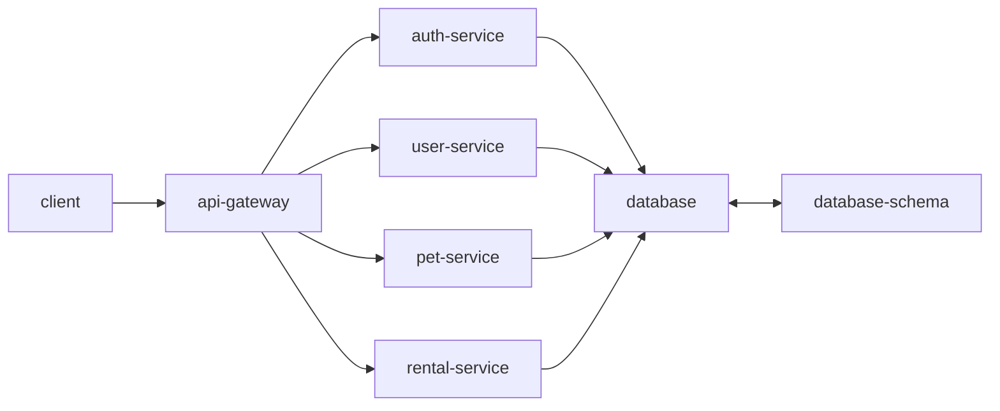
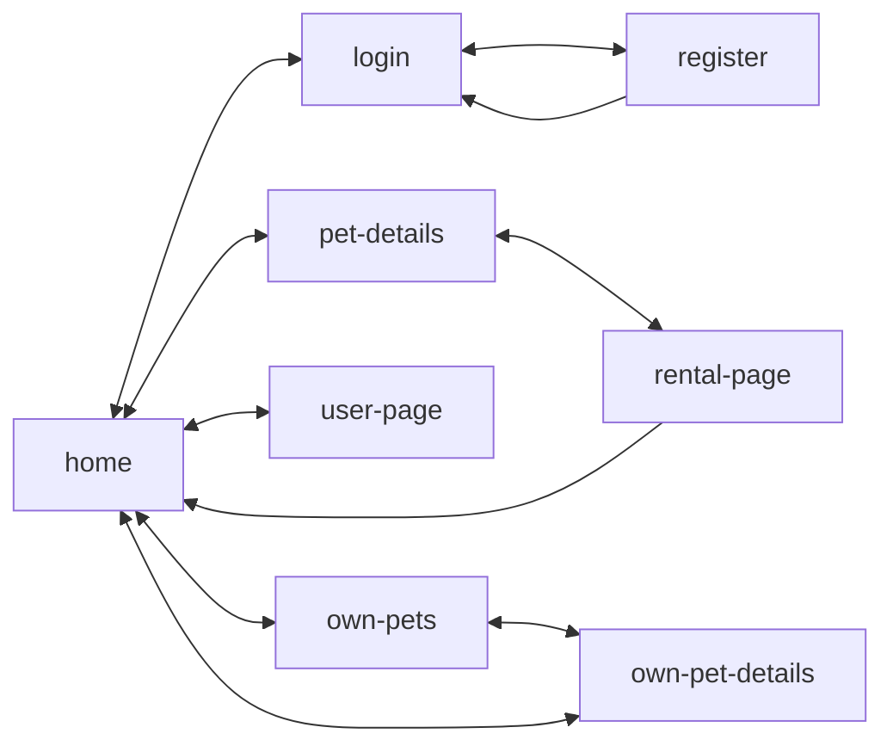

# Petly

A web app for renting pets built with a microservices architecture.

## Architecture

The application uses a microservices architecture with the following services:

- **Frontend**: React, TypeScript, Vite, Vitest, MUI, Tailwind, React Query
- **API Gateway**: TypeScript, Fastify, Vitest
- **Auth Service**: TypeScript, Fastify, JWT, Drizzle ORM
- **User Service**: TypeScript, Fastify, Drizzle ORM
- **Pet Service**: TypeScript, Fastify, Drizzle ORM
- **Rental Service**: TypeScript, Fastify, Drizzle ORM
- **Database**: PostgreSQL with Drizzle schema

### Service Architecture



### Application Flow



## Getting Started

### Prerequisites

- Node.js 24+
- Docker and Docker Compose
- PostgreSQL (via Docker)

### Environment Setup

The project requires environment configuration for database and services.

#### 1. Create Environment File

**`.env.dev`**

```env
# =============================================================================
# GENERIC CONFIGURATION
# =============================================================================

# Database Configuration
POSTGRES_DB=petly_dev
POSTGRES_USER=petly_dev
POSTGRES_PASSWORD=petly_dev
DB_HOST=localhost
DB_PORT=5432

# JWT Configuration
JWT_ACCESS_SECRET=your-access-secret-key-min-32-chars-change-in-production
JWT_REFRESH_SECRET=your-refresh-secret-key-min-32-chars-change-in-production
JWT_ACCESS_EXPIRES_IN=15m
JWT_REFRESH_EXPIRES_IN=7d

# =============================================================================
# SERVICE-SPECIFIC CONFIGURATION
# =============================================================================

# Auth Service
PORT=3001
HOST=0.0.0.0
```

### Database Setup

The project uses PostgreSQL with Drizzle ORM for schema management and migrations. The `database-schema` service handles all database schema definitions and migrations.

#### 2. Start Database and Run Migrations

The docker-compose setup will automatically start PostgreSQL and run migrations:

```bash
# Development
npm run dev

# Production
npm run prod
```

The `database-schema` service will wait for PostgreSQL to be healthy before applying migrations.

#### 3. Database Management Commands

```bash
# Generate new migration after schema changes
npm run generate

# Apply migrations manually
npm run migrate

# Open Drizzle Studio (database GUI)
npm run studio
```

### Database Schema

Current schema includes authentication tables:

- **users**: User accounts with username and password
- **refresh_tokens**: JWT refresh tokens for authentication

Schema definitions are located in `database-schema/src/schema/`.

### Installation

```bash
# Install all dependencies
npm install

# Start development environment
npm run dev
```

### Development Workflow

1. **Start the database and run migrations**:
   ```bash
   npm run dev
   ```

2. **Make schema changes** in `database-schema/src/schema/`

3. **Generate migration**:
   ```bash
   npm run generate
   ```

4. **Apply migration**:
   ```bash
   npm run migrate
   ```

5. **Inspect database**:
   ```bash
   npm run studio
   ```

## Services

### Auth Service

The authentication service handles user registration, login, token refresh, and logout using JWT.

#### Running the Auth Service

```bash
# Development mode (with auto-reload)
cd auth-service
npm run dev

# Production mode
npm run build
npm start

# Run tests
npm test
```

#### API Endpoints

**POST `/auth/register`**
Register a new user account.

```bash
curl -X POST http://localhost:3001/auth/register \
  -H "Content-Type: application/json" \
  -d '{
    "username": "testuser",
    "password": "securepassword123"
  }'
```

Response (201):
```json
{
  "accessToken": "eyJhbGciOiJIUzI1NiIs...",
  "refreshToken": "eyJhbGciOiJIUzI1NiIs..."
}
```

**POST `/auth/login`**
Login with existing credentials.

```bash
curl -X POST http://localhost:3001/auth/login \
  -H "Content-Type: application/json" \
  -d '{
    "username": "testuser",
    "password": "securepassword123"
  }'
```

Response (200):
```json
{
  "accessToken": "eyJhbGciOiJIUzI1NiIs...",
  "refreshToken": "eyJhbGciOiJIUzI1NiIs..."
}
```

**POST `/auth/refresh`**
Refresh access token using refresh token.

```bash
curl -X POST http://localhost:3001/auth/refresh \
  -H "Content-Type: application/json" \
  -d '{
    "refreshToken": "eyJhbGciOiJIUzI1NiIs..."
  }'
```

Response (200):
```json
{
  "accessToken": "eyJhbGciOiJIUzI1NiIs...",
  "refreshToken": "eyJhbGciOiJIUzI1NiIs..."
}
```

**POST `/auth/logout`**
Logout and invalidate refresh token.

```bash
curl -X POST http://localhost:3001/auth/logout \
  -H "Content-Type: application/json" \
  -d '{
    "refreshToken": "eyJhbGciOiJIUzI1NiIs..."
  }'
```

Response (204): No content

**GET `/health`**
Health check endpoint.

```bash
curl http://localhost:3001/health
```

Response (200):
```json
{
  "status": "ok"
}
```

#### Authentication Flow

1. **Register/Login**: User registers or logs in, receives `accessToken` and `refreshToken`
2. **Authenticated Requests**: Include `accessToken` in Authorization header: `Bearer <token>`
3. **Token Expiration**: Access tokens expire in 15 minutes (configurable)
4. **Refresh**: Use `refreshToken` to get new access tokens without re-login
5. **Logout**: Invalidate refresh token to prevent further token refreshing

#### Validation Rules

- **Username**: 3-50 characters
- **Password**: 8-100 characters, hashed with bcrypt
- **Tokens**: JWT with configurable expiration times

## Project Structure

```
petly/
├── docker-compose.yaml         # Container orchestration
├── .env                        # Service configuration (JWT, ports, etc.)
├── .env.dev                    # Development database config
├── .env.prod                   # Production database config
├── biome.json                 # Code linting and formatting config
├── commitlint.config.js        # Commit message linting
│
├── database-schema/            # Drizzle ORM schema & migrations
│   ├── src/
│   │   └── schema/             # Database table definitions
│   ├── migrations/             # Generated SQL migrations
│   ├── drizzle.config.ts       # Drizzle configuration
│   └── Dockerfile              # Migration service container
│
├── auth-service/               # Authentication service (JWT)
│   ├── src/
│   │   ├── config/             # Environment and database config
│   │   ├── routes/             # API route handlers
│   │   ├── services/           # Business logic
│   │   └── utils/              # JWT and password utilities
│   └── Dockerfile
│
├── frontend/                   # React application (TODO)
├── api-gateway/                # API Gateway service (TODO)
├── user-service/               # User management service (TODO)
├── pet-service/                # Pet management service (TODO)
└── rental-service/             # Rental management service (TODO)
```

## Code Quality & Development Tools

### Biome
The project uses Biome for linting and formatting:

```bash
# Check code quality
npm run ci

# Format code
npx biome format --write .

# Lint code
npx biome lint .
```
