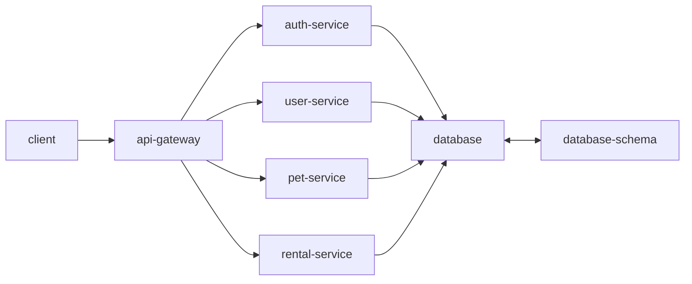
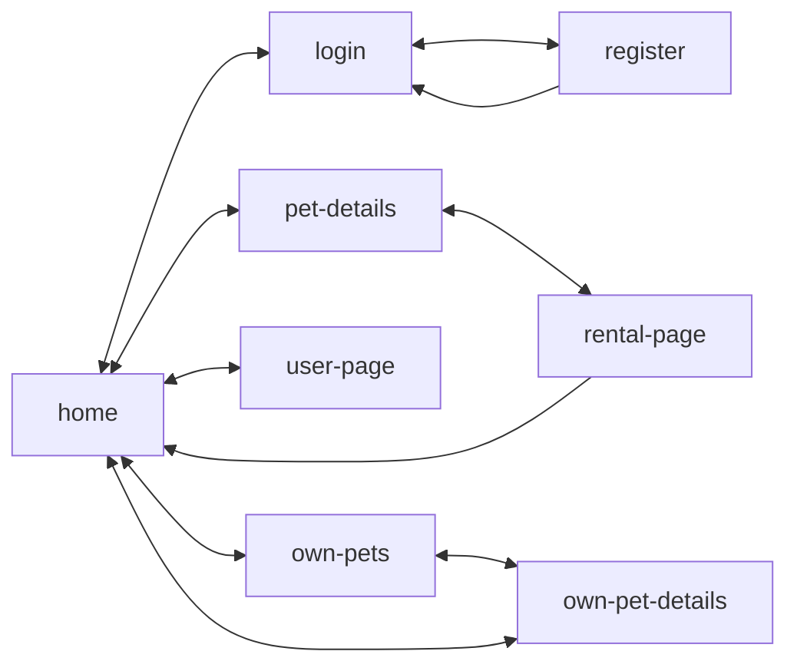

# Petly

A web app for renting pets built with a microservices architecture.

## Architecture

The application uses a microservices architecture with the following services:

- **Frontend**: React, TypeScript, Vite, Vitest, MUI, Tailwind, React Query
- **API Gateway**: TypeScript, Fastify, Vitest
- **Auth Service**: TypeScript, Fastify, JWT, Drizzle ORM
- **User Service**: TypeScript, Fastify, Drizzle ORM
- **Pet Service**: TypeScript, Fastify, Drizzle ORM
- **Rental Service**: TypeScript, Fastify, Drizzle ORM
- **Database**: PostgreSQL with Drizzle schema

### Service Architecture



### Application Flow



## Getting Started

### Prerequisites

- Node.js 24+
- Docker and Docker Compose
- PostgreSQL (via Docker)

### Database Setup

The project uses PostgreSQL with Drizzle ORM for schema management and migrations. The `database-schema` service handles all database schema definitions and migrations.

#### 1. Create Environment Files

Create environment files for database configuration:

**`.env.dev`**

```env
POSTGRES_DB=petly_dev
POSTGRES_USER=petly_dev
POSTGRES_PASSWORD=petly_dev
```

**`.env.prod`**

```env
POSTGRES_DB=petly_prod
POSTGRES_USER=petly_prod
POSTGRES_PASSWORD=your_secure_password
```

#### 2. Start Database and Run Migrations

The docker-compose setup will automatically start PostgreSQL and run migrations:

```bash
# Development
npm run dev

# Production
npm run prod
```

The `database-schema` service will wait for PostgreSQL to be healthy before applying migrations.

#### 3. Database Management Commands

```bash
# Generate new migration after schema changes
npm run generate

# Apply migrations manually
npm run migrate

# Open Drizzle Studio (database GUI)
npm run studio
```

### Database Schema

Current schema includes authentication tables:

- **users**: User accounts with username and password
- **refresh_tokens**: JWT refresh tokens for authentication

Schema definitions are located in `database-schema/src/schema/`.

### Installation

```bash
# Install all dependencies
npm install

# Start development environment
npm run dev
```

### Development Workflow

1. **Start the database and run migrations**:
   ```bash
   npm run dev
   ```

2. **Make schema changes** in `database-schema/src/schema/`

3. **Generate migration**:
   ```bash
   npm run generate
   ```

4. **Apply migration**:
   ```bash
   npm run migrate
   ```

5. **Inspect database**:
   ```bash
   npm run studio
   ```

## Project Structure

```
petly/
├── docker-compose.yaml         # Container orchestration
├── .env.dev                    # Development database config
├── .env.prod                   # Production database config
│
├── database-schema/            # Drizzle ORM schema & migrations
│   ├── src/
│   │   └── schema/             # Database table definitions
│   ├── migrations/             # Generated SQL migrations
│   ├── drizzle.config.ts       # Drizzle configuration
│   └── Dockerfile              # Migration service container
│
├── frontend/                   # React application
├── api-gateway/                # API Gateway service
├── auth-service/               # Authentication service
├── user-service/               # User management service
├── pet-service/                # Pet management service
└── rental-service/             # Rental management service
```

## User Stories

- As a user I want to see the application
- As a user I want to log in so that I can use the application
- As a user I want to add a pet so that it can be rented
- As a user I want to modify pet information so that it stays up to date
- As a user I want to update my information so that it stays current
- As a user I want to rent a pet so that I can enjoy their company

## Open Questions & TODOs

- How to handle dependency updates across multiple package.json files (Dependabot? Automated PRs?)
- Can shared dependencies be consolidated across services?
- CI/CD pipeline setup and strategy
- Production deployment and internet exposure strategy
- Monitoring and logging strategy
- API documentation (Swagger/OpenAPI?)
