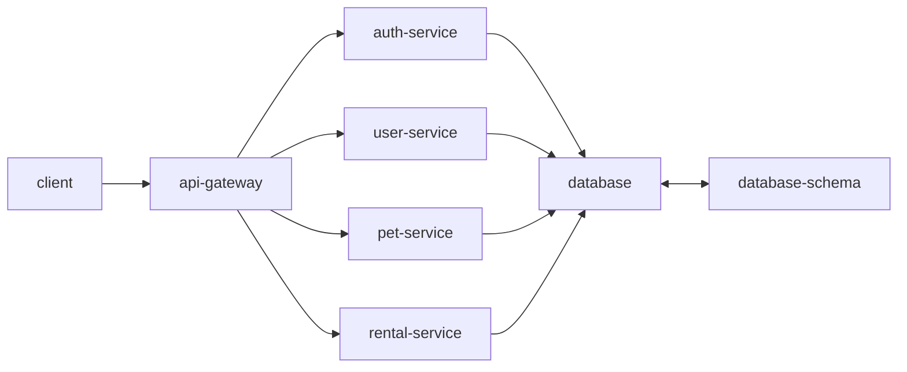
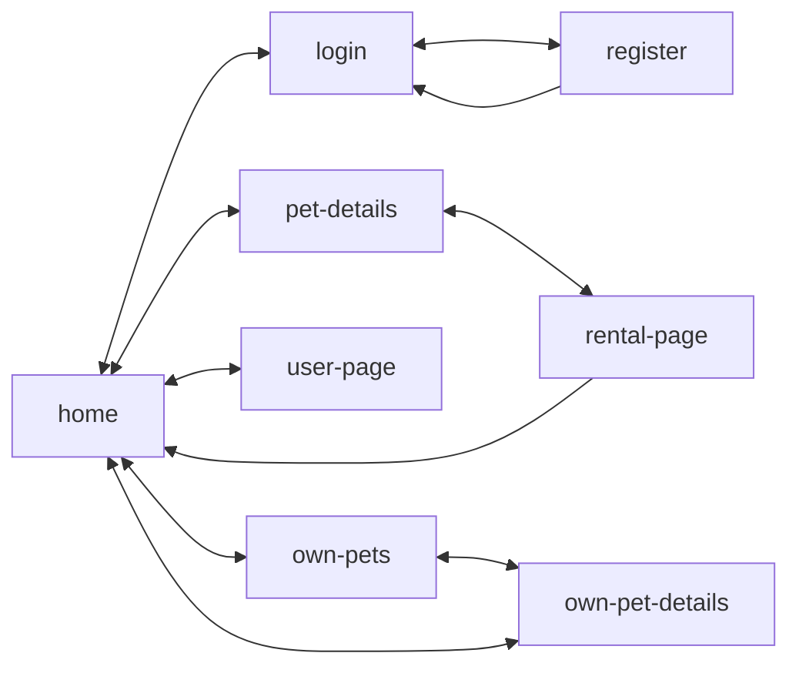

# Petly

A web app for renting pets built with a microservices architecture.

## Architecture

The application uses a microservices architecture with the following services:

- **Frontend**: React, TypeScript, Vite, Vitest, MUI, Tailwind, React Query
- **API Gateway**: TypeScript, Fastify, Vitest
- **Auth Service**: TypeScript, Fastify, JWT, Drizzle ORM
- **User Service**: TypeScript, Fastify, Drizzle ORM
- **Pet Service**: TypeScript, Fastify, Drizzle ORM
- **Rental Service**: TypeScript, Fastify, Drizzle ORM
- **Database**: PostgreSQL with Drizzle schema

### Service Architecture



### Application Flow



## Getting Started

### Prerequisites

- Node.js 24+
- Docker and Docker Compose
- PostgreSQL (via Docker)

### Database Setup

1. Create environment files for database configuration:

**`.env.dev`** (for development):

```env
POSTGRES_DB=petly_dev
POSTGRES_USER=petly_dev
POSTGRES_PASSWORD=petly_dev
```

**`.env.prod`** (for production):

```env
POSTGRES_DB=petly_prod
POSTGRES_USER=petly_prod
POSTGRES_PASSWORD=your_secure_password
```

2. Start the database:

```bash
# Development
docker-compose --env-file .env.dev up -d

# Production
docker-compose --env-file .env.prod up -d
```

### Installation

```bash
# Install dependencies for all services
npm install

# Run database migrations
npm run migrate

# Start development servers
npm run dev
```

## Project Structure

```
petly/
├── docker-compose.yaml         # Container orchestration
├── frontend/                   # React application
├── api-gateway/                # API Gateway service
├── auth-service/               # Authentication service
├── user-service/               # User management service
├── pet-service/                # Pet management service
├── rental-service/             # Rental management service
└── database-schema/            # Drizzle database schema
```

## User Stories

- As a user I want to see the application
- As a user I want to log in so that I can use the application
- As a user I want to add a pet so that it can be rented
- As a user I want to modify pet information so that it stays up to date
- As a user I want to update my information so that it stays current
- As a user I want to rent a pet so that I can enjoy their company

## Open Questions & TODOs

- How to handle dependency updates across multiple package.json files (Dependabot? Automated PRs?)
- Can shared dependencies be consolidated across services?
- CI/CD pipeline setup and strategy
- Production deployment and internet exposure strategy
- Monitoring and logging strategy
- API documentation (Swagger/OpenAPI?)
