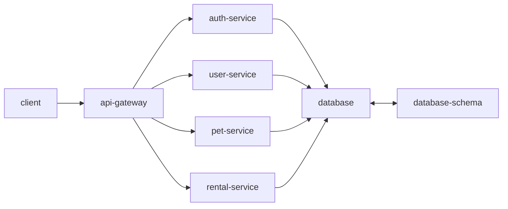
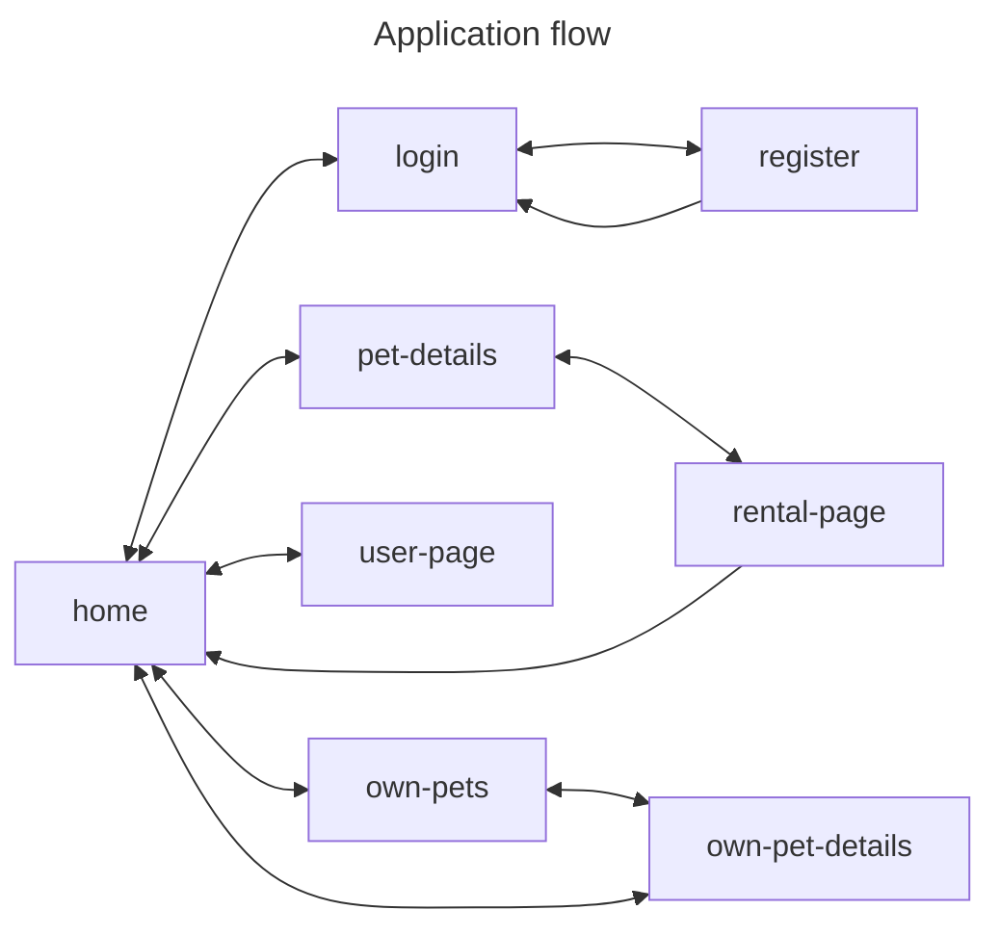

# Petly

A web app for renting pets

## User stories

- As a user I want to see the application
- As user I want to log in the application so that I can use the application
- As a user I want to add a pet so that it can be rented
- As a user I want to modify the pets information so that they are up to date
- As a user I want to update my information so that they are up to date
- As a user I want to rent a pet so that I can enjoy their company

## Architecture

---

petly/

docker-compose.yaml (container stuff)

frontend/ (React, typescript, vite, vitest, mui, tailwind react-query, react contexts)

api-gateway/ (typescript, Fastify, vitest)

auth-service/ (typescript, Fastify, vitest, JWT, Drizzle)

user-service/ (typescript, fastify, vitest, Drizzle)

pet-service/ (typescript, fastify, vitest, Drizzle)

rental-service/ (typescript, fastify, vitest, Drizzle)

database-schema/ (Drizzle)

## Issues

- multiple folders with package.json files, how to handle dependency updates (dependabot? automate pull requests)
- same dependencies on many folders, can I somehow combine them?
- how to handle CI
- how to expose the app in the internet
